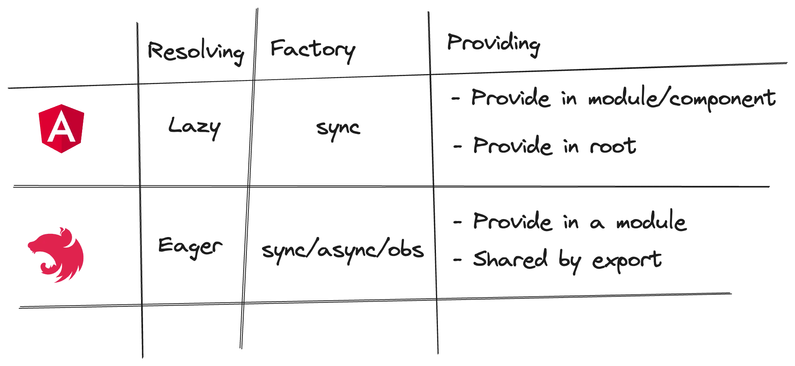
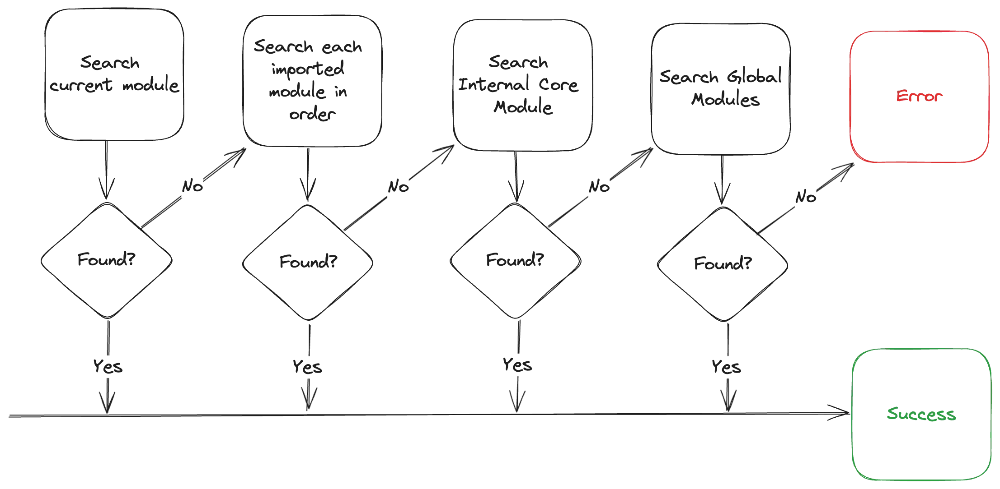

# Angular and NestJS Dependency Injection

In software engineering, dependency injection is a programming technique in which an object or function receives other
objects or functions that it requires instead of creating them internally.

[NestJS](https://nestjs.com) is a NodeJS application framework heavily inspired
by [Angular](https://angular.dev) ([reference](https://docs.nestjs.com/)). Both implement constructor-based
dependency injection using TypeScript decorators.

While the dependency injection APIs of **Angular** and **NestJS** may appear similar, their underlying mechanisms are
distinct
and unique.

Let’s examine the differences.



## Resolving

Angular is the lazy fellow. If we don’t need something, there is no reason to create it. Think about a component with a
service as a dependency. If the component is never rendered, it is unnecessary to create its dependencies.

NestJS is a server application. It does not have the performance issues the front-end client needs to deal with.
Everything is loaded to satisfy the controller’s dependencies, which must be wired to the HTTP engine under the hood (
Express, Fastify, …).

_Update_

NestJS added support for lazy loading. I don’t get it.

## Factory

**Angular** dependency injection serves the components. The rendering hook is a sync one. We can not wait for future (
Promise/Observable) to be resolved while rendering. Therefore, sync only.

Server applications can have an initial time, such as connecting external resources. Since this can involve async code,
**NestJS** lets us choose between sync and async.

**NestJS** (and **Angular**) is built using **RxJS** as a utility library, which lets us also provide a factory return
observable.
However, it seems like an overkill. I wouldn’t say I like multiple APIs for the same operation.

## Providing

### Angular

Angular injectable classes can be annotated with “provide in root” and become available to the whole application.

```ts

@Injectable({provideIn: 'root'})
class Service {
}
```

The second way is by providing it in an Angular module (NgModule) or component (standalone).

```ts

@Component({
    standalone: true,
    providers: [Service],
    ...
})
class AngularComponent {
}
```

Importing NgModule that provides a service will behave like “provide in root” and make the service available for the
whole
application ([reference](https://v17.angular.io/guide/ngmodule-faq#why-is-a-service-provided-in-a-feature-module-visible-everywhere)).

```ts

@NgModule({
    providers: [Service],
})
class AngularModule {
}
```

### NestJS

NestJS module is a traditional one. Dependencies should be provided in the same module or exported from the imported
ones.

```ts

@Module({
    providers: [Service],
    exports: [Service],
})
class NestModule {
}
```

The NestJS dependencies search starts at the current, then searches imported, internal core, and global modules in this
order.



